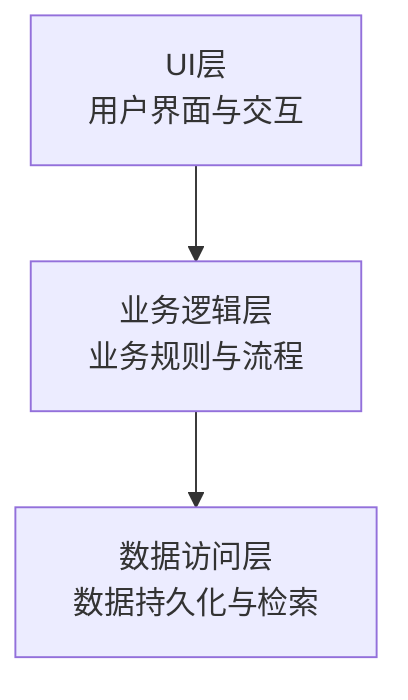
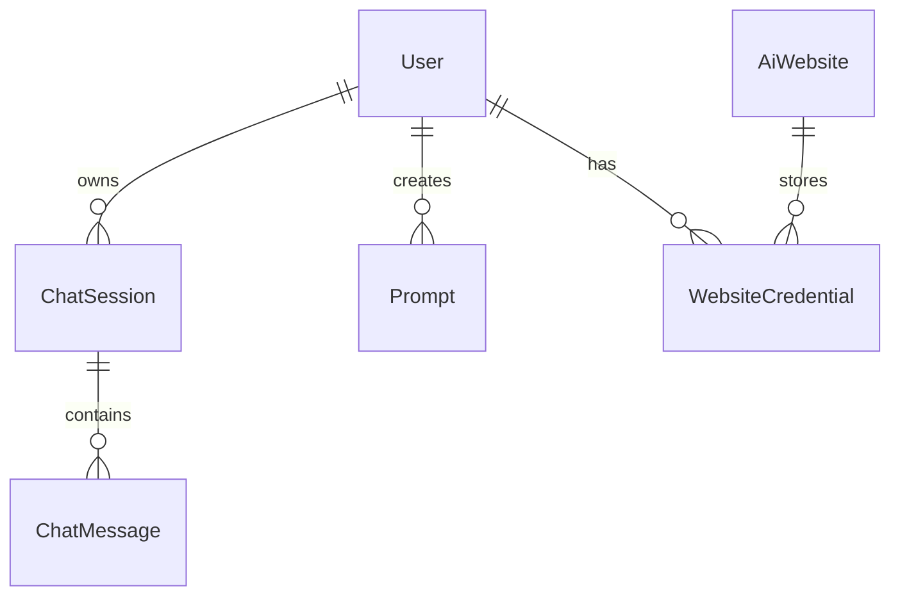
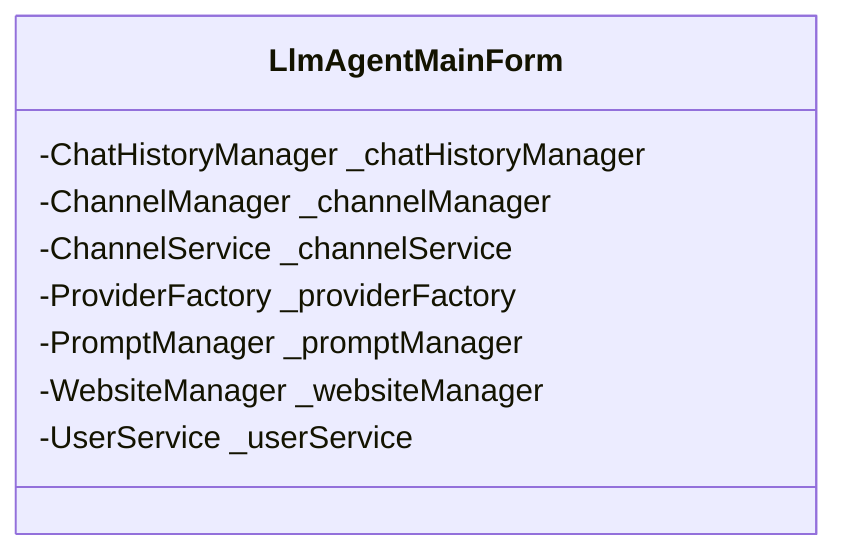
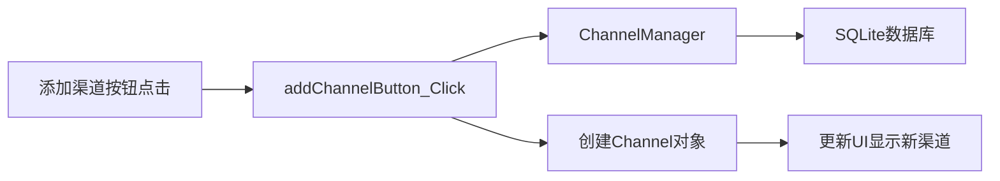
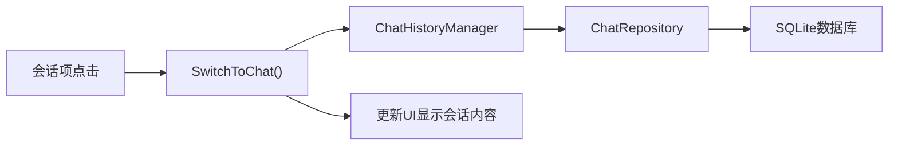

# LLM代理应用架构概览

本文档提供了LLM代理应用的整体架构设计和关键组件说明。

## 应用架构分层

该应用程序采用标准的三层架构设计，各层职责明确分离：



### UI层 (UI 目录)

- **职责**：提供用户界面和交互功能
- **主要组件**：
  - `Forms/` - 包含应用程序窗体
    - `LlmAgentMainForm.cs` - 主窗体
    - `LoginForm.cs` - 登录窗体
    - `RegisterForm.cs` - 注册窗体
    - `PasswordVerificationForm.cs` - 密码验证窗体
    - `ModelManagementForm.cs` - 模型管理窗体
    - `AddWebsiteForm.cs` - 添加网站窗体
    - `Test/ModelTestForm.cs` - 模型测试窗体
    - `Test/ChannelTestForm.cs` - 渠道测试窗体
  - `Controls/` - 自定义控件
    - `ChatSessionItem.cs` - 聊天会话项控件
    - `PromptCardItem.cs` - 提示词卡片控件
    - `UserCardItem.cs` - 用户卡片控件
    - `WebsiteCardItem.cs` - 网站卡片控件
    - `WebsiteBrowser.cs` - 网站浏览器控件
    - `CustomTitleBar.cs` - 自定义标题栏控件
    - `HiddenScrollBarFlowLayoutPanel.cs` - 隐藏滚动条的流布局面板
    - `ChatForm/` - 聊天相关控件
      - `Chatbox.cs` - 聊天框控件
      - `ChatItem.cs` - 聊天项控件
      - `ChatModelAdapter.cs` - 聊天模型适配器
      - `ChatModels.cs` - 聊天模型定义
      - `ChatPanel.Functions.cs` - 聊天面板功能扩展
      - `ChatboxInfo.cs` - 聊天框信息类
    - `SimpleMessageDisplay/` - 简单消息显示控件
      - `SimpleMessageDisplay.cs` - 简化版消息显示控件

### 业务逻辑层 (BLL 目录)

- **职责**：实现业务规则和逻辑，连接UI和数据层
- **主要组件**：
  - `ChatHistoryManager.cs` - 聊天历史管理
  - `ChannelManager.cs` - 渠道管理
  - `ChannelService.cs` - 渠道服务
  - `UserService.cs` - 用户服务
  - `LoggedInUserService.cs` - 登录用户服务
  - `PromptManager.cs` - 提示词管理
  - `WebsiteManager.cs` - 网站管理

### 数据访问层 (DAL 目录)

- **职责**：处理数据持久化和检索
- **主要组件**：
  - `ChatRepository.cs` - 聊天数据仓库
  - `DatabaseManager.cs` - 数据库管理
  - `UserRepository.cs` - 用户数据仓库
  - `LoggedInUserRepository.cs` - 登录用户数据仓库
  - `PromptRepository.cs` - 提示词数据仓库
  - `WebsiteRepository.cs` - 网站数据仓库

### API接口层 (API 目录)

- **职责**：封装与外部LLM服务的交互
- **主要组件**：
  - `Provider/BaseLLMProvider.cs` - 提供商基础抽象类
  - `Provider/LLMProvider.cs` - LLM提供商接口定义
  - `Provider/ProviderFactory.cs` - 提供商工厂
  - `Provider/OpenAIProvider.cs` - OpenAI提供商实现
  - `Provider/AzureOpenAIProvider.cs` - Azure OpenAI提供商实现
  - `Provider/AnthropicProvider.cs` - Anthropic提供商实现
  - `Provider/GeminiProvider.cs` - Google Gemini提供商实现
  - `Provider/SiliconFlowProvider.cs` - SiliconFlow兼容服务实现

### 数据模型 (Model 目录)

- **职责**：定义应用程序的数据结构
- **主要组件**：
  - `ChatSession.cs` - 聊天会话模型
  - `ChatMessage.cs` - 聊天消息模型
  - `ChatRole.cs` - 聊天角色枚举
  - `Channel.cs` - 渠道模型
  - `Models.cs` - 模型信息定义
  - `User.cs` - 用户模型
  - `Prompt.cs` - 提示词模型
  - `AiWebsite.cs` - AI网站模型
  - `WebsiteCredential.cs` - 网站凭据模型
  - `ProviderType.cs` - 提供商类型枚举

## 数据存储机制

应用程序使用多种存储机制来持久化不同类型的数据：

> 详细的数据存储架构、用户数据与应用数据分离方案、数据结构和技术栈，请参阅[数据存储](./data-storage.md)文档。

### 1. SQLite数据库存储

用于持久化聊天会话、消息、模型信息和渠道配置：

- **聊天数据**：
  - `ChatSessions` 表 - 存储会话基本信息
  - `ChatMessages` 表 - 存储聊天消息
  
- **模型数据**：
  - `Models` 表 - 存储各提供商支持的模型信息

- **渠道配置**：
  - `Channels` 表 - 存储渠道基本信息
  - `ChannelModels` 表 - 存储渠道支持的模型

### 2. 应用程序设置

用于存储用户首选项和应用配置：

- **机制**：使用 .NET 的 `Properties.Settings`
- **存储项**：
  - 上次选择的提供商
  - 上次选择的模型
  - 系统提示
  - 流式响应设置

## 数据模型及关系

### 核心数据模型

1. **聊天会话 (ChatSession)**
   ```mermaid
   classDiagram
     class ChatSession {
       +string Id
       +string Title
       +DateTime CreatedAt
       +DateTime UpdatedAt
       +List~ChatMessage~ Messages
     }
   ```

2. **聊天消息 (ChatMessage)**
   ```mermaid
   classDiagram
     class ChatMessage {
       +string Id
       +ChatRole Role
       +string Content
       +DateTime CreatedAt
       +DateTime UpdatedAt
       +DateTime Timestamp
       +string ModelId
       +string RoleString
     }
   ```

3. **渠道 (Channel)**
   ```mermaid
   classDiagram
     class Channel {
       +Guid Id
       +string Name
       +ProviderType ProviderType
       +string ApiKey
       +string ApiHost
       +bool IsEnabled
       +bool UseStreamResponse
       +List~string~ SupportedModels
       +DateTime CreatedAt
       +DateTime UpdatedAt
     }
   ```

4. **模型信息 (ModelInfo)**
   ```mermaid
   classDiagram
     class ModelInfo {
       +string Id
       +string Name
       +string ProviderType
       +int? ContextLength
       +double? TokenPrice
       +bool Enabled
     }
   ```

### 数据关系



- 一个聊天会话包含多条聊天消息
- 一个用户拥有多个聊天会话
- 一个用户可以创建多个提示词
- 一个用户可以有多个网站凭据
- 一个AI网站可以存储多个用户的凭据

## 控件间数据交流

### 主窗体与业务逻辑层交互

主窗体 (`LlmAgentMainForm`) 持有各业务逻辑管理器的实例：



### 数据流动路径

#### 1. 发送聊天消息的数据流


#### 2. 添加新渠道的数据流



#### 3. 切换聊天会话的数据流

