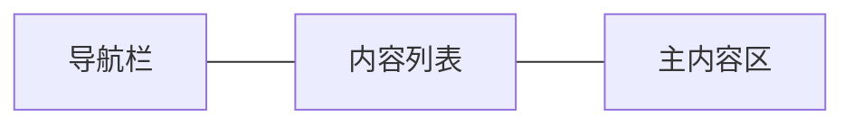

# UI设计

## UI设计概述

LLM Agent应用采用现代化的三列布局设计，提供直观、高效的用户交互体验。

## 三列布局结构



1. **左侧导航栏**
   - 固定宽度，包含主要功能导航按钮
   - 顶部显示应用Logo和用户头像

2. **中间内容列表**
   - 可调整宽度，显示当前页面的列表内容
   - 聊天模式下显示会话列表

3. **右侧主内容区**
   - 占据主要空间，显示详细内容和交互界面
   - 聊天模式下显示消息内容和输入区域

## 控件层次结构

应用使用嵌套的SplitContainer实现灵活的布局调整：

```
mainSplitContainer
├── Panel1 (导航栏)
│   └── navPanel
├── Panel2 (内容区)
    └── contentSplitContainer
        ├── Panel1 (内容列表)
        │   └── listPanel
        └── Panel2 (主内容区)
            └── mainPanel
```

## 配色方案

紫色与灰色

## 响应式设计

应用界面支持响应式调整，确保在不同窗口大小下的良好体验：

- SplitContainer分隔条可拖动调整各区域大小
- 最小窗口尺寸限制，确保基本功能可用性
- 支持全屏模式 