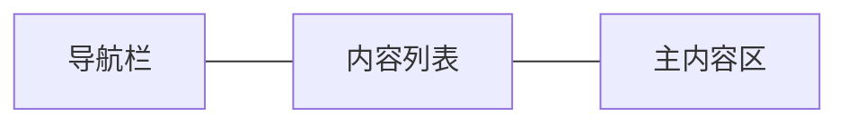

# UI设计

## UI设计概述

LLM Agent应用采用现代化的三列布局设计，提供直观、高效的用户交互体验。

## 三列布局结构



1. **左侧导航栏**
   - 固定宽度70px，包含主要功能导航按钮
   - 包含用户头像按钮、聊天、渠道、网站、提示词、设置等导航按钮

2. **中间内容列表**
   - 可调整宽度，显示当前页面的列表内容
   - 聊天模式下显示会话列表

3. **右侧主内容区**
   - 占据主要空间，显示详细内容和交互界面
   - 聊天模式下显示消息内容和输入区域

## 控件层次结构

应用使用嵌套的SplitContainer实现灵活的布局调整：

```
mainSplitContainer
├── Panel1 (导航栏)
│   └── navPanel
│       ├── avatarButton
│       ├── chatNavButton
│       ├── channelNavButton
│       ├── websiteNavButton
│       ├── promptsNavButton
│       └── settingsNavButton
└── Panel2 (内容区)
    ├── chatPagePanel
    ├── channelPanel
    ├── aiWebsitePanel
    ├── userProfilePanel
    ├── promptsPanel
    └── settingsPanel
```

## 配色方案

应用采用现代化的配色方案：

- **主色调**: 紫色系 (RGB: 100, 101, 165) - 用于导航栏和主要按钮
- **背景色**: 白色和浅灰色 (RGB: 247, 247, 247) - 用于内容区域
- **强调色**: 深紫色 (RGB: 76, 76, 128) - 用于按钮悬停和选中状态
- **文本色**: 深灰色和黑色 - 确保良好的可读性

## 响应式设计

应用界面支持响应式调整，确保在不同窗口大小下的良好体验：

- SplitContainer分隔条可拖动调整各区域大小
- 最小窗口尺寸限制，确保基本功能可用性
- 支持全屏模式
- 最小窗口尺寸：888x564像素

## 交互设计特点

- **一致性**: 所有页面采用相同的三列布局结构
- **可访问性**: 支持键盘导航和工具提示
- **响应性**: 异步操作不阻塞UI，提供良好的用户体验
- **视觉反馈**: 按钮悬停、选中状态有明确的视觉反馈